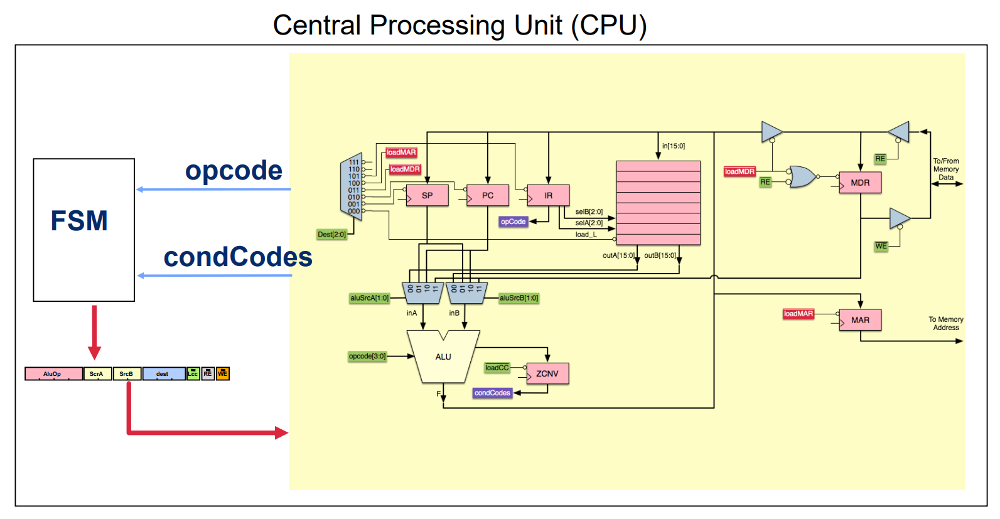

# ECE3070 计算机组成原理


## System Verilog 快速上手

1. module部分

   * 定义和实例元件

     ```verilog
     module example (
         // 在开头的括号中定义这个元件的输入和输出
         input logic a, b,
         output logic f
     );
         // 创建元件的内部信号并定义它
         logic na;
         assign na = ~a;
         
         // 实例化逻辑门，并且接入信号。第一位是输出，后面可以有不定位数的输入
         and g0 (f, na, b);
         
         // 实例其他模块并连接
         module_name instance_name(
             .in1(a), // .port(signal)的形式，比如这里让 in1（实例的模块的端口） <= a（本元件中的信号）
             .in2(b),
             .f(f), // 如果端口名和信号名相同，可以直接 .* 连接全部
         )
         
     endmodule
     
     module module_name (
         input logic in1, in2,
         output logic f
     );
     endmodule
     ```

2. 常用语法

   * 多位宽信号parameter

     ```verilog
     // RT设计中需要多位宽的数据传输，可以在定义元件输入输出的时候设置
     module example (
         // 可以用parameter语法设置参数，方便修改位宽
         #(parameter W = 3)
         // 然后直接给输入输出信号设置位宽
         input logic [W-1: 0] D,
         output logic [W-1:0] Q
     );
        
     // parameter 的参数还可以在实例化模块的时候被覆写
         register #(8) r1 (Sum, a , clk, rst);
         regisrer #(4) r2 (S, aluOut, clk, rst);
     ```

   * always逻辑

     ```verilog
     // always语法检测指定信号的特征，在检测到时会立刻跳转到这个部分的代码块运行
     // 后面的_ff和_comb决定了代码块中的内容将会以时序逻辑还是组合逻辑运行
     // 如果是组合逻辑，则每一行代码会立即执行
     // 如果是时序逻辑，则程序会先保留一份当前状态的快照，在代码全部执行完成后同时进行赋值
     always_ff@(posedge clk or negedge clk) begin
         if (!clk) begin
             q <= b;
         end else begin
             q <= 0;
         end
         
     end
     ```

3. 串行操作

   一些常见的串行算法逻辑，考试可能会用到

   1. 串行加法

      * LSB先进

      sum = A XOR B XOR carry

      next_carry = majority(A, B, carry)

   2. 串行补码

      * LSB先进

      见到第一个1之前原样输出（包括这个1），见到后全取反

   3. 串行奇偶校验

      状态：parity（当前奇偶性）

      parity = parity XOR 输入

   4. 串行比较器

      * MSB先进

      状态：A更大，B更大，相等

      A = 1, B = 0 → 转到A大

      A = 0, B = 1 → 转到B大

      否则保持相等

   5. 串行乘法

      * LSB先进

      每次看B的一位

      1: 把A加进累加器

      0: 不加

      每位看完把A左移一位

      

   ### 规律总结

   几乎所有串行操作都是同一个模式：

   ​	状态 = 到目前为止需要记住的信息

   ​	输出 = f(当前输入, 当前状态)

   ​	下一状态 = g(当前输入, 当前状态)

## 基础组合元件

1. MUX的用法

   先来一些常见画法吧

   

   

   MUX的最重要用途就是用来**表示或化简函数**

   

   这是通过提公因式化简，有点不够公式化。

   

   引入叫香农展开的nb化简方法

   * 对于任意逻辑表达式，可以递归使用香农展开进行分解化简
     $$
     F(x_1,x_2,\dots,x_n)=x_i\cdot F(x_i=1)+x_i'\cdot F(x_i=0)
     $$
     在上式中，$F(x_i=1)$与$F(x_i=0)$还可以分别使用香农展开进行分解

   * 这样做的意义是，可以把复杂的表达式用嵌套MUX进行表示

   

2. 比较器的用法

   

   长这样。按位比较，在两位相同的情况下，上一位的进位是“相同”，才会输出“相同”

   * 按位处理的思路叫Bit-Slicing，算数电路中会容易用到

   

3. Demux和解码器的用法

   1. Demux

      与MUX相反，从n路输出中选择一路输出数据。其他不输出的路会设置为0

   2. 解码器

      将一种编码转换为另一种

      默认转换为独热编码


## 有限状态机

1. 寄存器

   寄存器由一群触发器组成，它们共用同一个CLK和EN

   

   

2. FSM

   Moore的大体框架长这样

   

   Mealy的框架就是Moore加一根线从输入直接连到输出生成器

   设计的逻辑和两者的具体理解角度都在2050笔记里


## 时序延迟

<small>虽然很烦，但这个确实有点重要</small>

1. 根本思路

   T~cyc~ >= T~clk2q~ + T~prop~ + T~setup~（最长不能超过一个周期长）

   T~clk2q~ + T~cont~ >= T~hold~（为了运算顺利完成寄存器得在计算开始后保持一段时间）

   

2. 术语和意义

   讨论组合逻辑电路时，一般说的是两个寄存器之间的组合电路部分。

   这个部分有总输入PI和总输出PO

   

   * critical path（最长路径）：从PI到PO的最长延迟，**决定计算能不能在一个周期内完成**
   * short path（最短路径）：从PI到PO的最短延迟，**防止有些信号跑太快干扰还在保持输出的寄存器**

   根据这两个路径的作用，它们对应的延迟分别叫

   * 传播延迟

   * 污染延迟

     

3. 分析和计算

   从PO往回一个门一个门地遍历，就可以找出所有可能路径，再计算每条路径的门延迟之和即可

   * 传播延迟：路上所有门的传播延迟之和，找所有路径中的最大值
   * 污染延迟：路上所有门的污染延迟之和，找所有路径中的最小值

   

   特殊情况：

   1. 分散重收敛：有时候，计算得到的critical path和short path会经过同一个元件，这个元件的输出给到多个其他门，才产生了多条路径。但是我们考虑延迟时，传播延迟和污染延迟是同时考虑的，可由于它们经过了同一个元件，这个元件很显然不能同时以最快和最慢速度输出一个信号，因此需要重新考虑。
   1. 伪路径：有些路径虽然物理上连接了，实际上信号有可能永远不经过它。这种“伪路径”不应该纳入计算
   
   
   
   触发器有一些时序性质要求：在CLK到来前后，其输入必须稳定；在CLK后一段时间内，其输出不稳定
   
   
   
   可以把CLK理解为起跑枪声，CLK到来的同时，FF立刻开始更新输出
   
   * CLK到来前
   
     T~su~设置时间：FF的输入保持稳定的时间
   
   * CLK到来后
   
     T~h~维持时间：FF的输入继续保持稳定的时间
   
     T~clk2q~传播时间：FF的输出达到稳定所需的时间
   
   
   
   这些运算都要在一个周期内完成：T~cyc~ >= T~prop~ （组合运算耗时）+ T~clk2q~（寄存器输出稳定耗时） + T~setup~（下个寄存器需要这个信号稳定的耗时）
   
   新数据最快可以什么时候来：T~clk2q~ + T~cont~（新的输入最快到来的时间） >= T~hold~（寄存器还需要保持稳定的时间）
   
   
   
   其他需要考虑的问题
   
   * 时钟偏移（CLK信号到达不同元件的时间不一样）
   * 异步输入（setup时间不确定了）/（在CLK时输入异步输入可能导致输出震荡）
   * 毛刺
   
   
   
4. 基本设计逻辑

   * 满足延迟范围
   * 用低偏移时钟同步所有FF
   * 异步输入必须先被同步
   * 时钟信号不能做任何计算
   * Reset和Preset等特殊信号也必须同步


## 数据通路

1. 总览

   理论上讲，任何同步序列电路都可以算一个有限状态机。但是当设计的规模逐渐变大，这个状态机的状态数将会以不可控的速度增长，最终变得无法实现。

   因此，如今的工业设计一般以FSM-D架构进行设计。

   * Datapath：所有的“数据”只会出现在这个部分，所有的运算处理也都只会在这个部分进行

   * FSM：Datapath里所有的控制信号（Reset, CLR...)都由这个部分产生并发送给Datapath

   简而言之，FSM-D架构就是把运算部分和控制部分分开了，只有控制部分是真正的状态机，也让状态数变得可控了

   * RT（Register Transfer）：数据在机器中的路径一定是从寄存器出发，经过数据通路进行运算，然后到达下一个寄存器

     

2. SV实现框架

   1. 寄存器模块

      单个FF：用always_ff逻辑检测clk的上升沿信号，再根据控制信号输入数据

      寄存器：输入宽度用parameter设置为多位，其他跟FF一样

   2. FSM模块

      用enum logic定义状态，然后在always_comb逻辑中用case语句定义每个状态的输出

      用always_ff来在每个时钟刻让当前状态=下一状态（cs <= ns）

      

3. 设计方法

   第一步：理解需求（确定总输入输出）

   第二步：设计datapath

   1. 哪些数据需要保留（确定寄存器）
   2. 需要执行哪些操作（确定需要的其他组合元件）
   3. 连接datapath部分的连线，确认提供给FSM的信号

   第三步：设计FSM

   1. 确定所有输入信号
   2. 设计好状态
   3. 确定每个状态的弧入和弧出

   

   * 用计数器可以减少FSM的状态，特别是在执行重复任务时
   * datapath应该是RTL结构

   

   模块概略图

   

4. 新元件

   1. 移位寄存器

   2. 计数器

      不断增加一个寄存器中的数

      可以视作一个寄存器加一个加法器

      * 计数器 + 比较器可以实现类似 for 循环的操作

## 内存

1. 接口：

   

   内存不能同时被读和写

   

2. 总线驱动器

   为了让内存的读和写可以用同一条线而引入的元件

   

   用en来选择读或是写

   最后就简化成下图


3. 内存的sv实现

   接口：

   

   * 数据的输入输出使用了inout wire类型

   读取与写入：

   ```verilog
   assign Data = (re) ? out: 'bz;
   
   always_ff @(posedge clock)
   	if (we) M[Addr] <= Data;
   
   always_comb
   	out = M[Addr];
   ```

   首先comb逻辑把Addr位置的数据复制到out

   然后如果re开启，将data的值变为out，否则为高阻态

   * data就是总线，如果为高阻态，则其由其他连接到总线上的元件驱动
   * sv中，如果多于一个元件同时驱动总线，会变成x即未知值，而现实中则是可能直接导致电路烧毁

   其次如果we开启，将data中的值赋给Addr位置

4. DRAM（动态内存）

   * 利用电容实现
   * 无论如何都会有泄漏，1最终会变为0
   * 读取时抹除数据
   * DRAM电容的充能以反指数速度下降，每隔4毫秒需要重写一次

   1. 寻址

      strobe signal：告诉内存，信号已稳定，可以采样的辅助信号

      地址被拆成行地址和列地址两个部分分别输入

      * 这样只需要8个地址引脚和2个strobe引脚即可控制，否则需要16个地址引脚外加一个strobe引脚

        

   2. 读取

      读取的同时就会自动重新充电

      

      步骤：ras低→ 行地址锁存，row latch就绪；cas低→ 列地址锁存，获取数据并输出；ras高→ row latch写回内存；cas高→ 关闭输出

      

   3. 写入

      写入的时候会先把整个字节读到一个锁存器里，修改后再写入回去

      这是因为字节只能整个一起被读取，单独修改一个比特的话整个字节都会消失

      

      步骤：ras低→ 数据写入row latch；we低→ 使能Din；cas低→ 融合Din与row latch中的数据；ras高→ 数据写回内存

   4. 刷新

      每4ms都要刷新一次

      

      ras拉低并拉高一次，相当于数据写入row latch再写回

5. 各种其他内存

   SRAM（静态）：有电数据就在，无需刷新，速度快

   SSRAM（同步静态）：SRAM加了钟

   DRAM（动态）：需要一直刷新，速度慢

   SDRAM（同步动态）：DRAM加了钟

   DDR SDRAM（双倍速）：时钟上升和下降沿各传一次数据

   Mask ROM：出厂就刻好的

   PROM（可编程）：一次性写入后不可修改

   EPROM（可擦除）：紫外照射可手动整片擦除，需要拆下芯片

   EEPROM（电可擦除）：用电就可有限次数修改，可按字节擦，速度慢

   Flash（闪存）：加强版EEPROM，只能整块擦除，速度快成本低

## 汇编

1. 框架

   我们希望在内存中储存我们的程序，然后电脑应该自动读取每一行指令并执行

   因此，汇编语言的执行顺序为：Fetch（从内存获取指令） → Decode（判断这条指令要做什么） → Execute

   一个简单的示例：

   

   * 现在的程序储存式处理器的特点

     1. 程序线性地存在内存中
     2. 指令按顺序执行
     3. 有通用的基本功能

   * 指令集架构

     存在很多种不同的指令集架构如ARM，x86，RISC-V

     * 主要分为两派：RISC（指令很多，但是很简单），CISC（指令少，但是复杂）

     同一个指令集架构，也有很多不同的FSM-D设计

2. p18240

   1. 基础指令

      Load（从内存中获取数据到寄存器）

      * LDA	Rd, addr（地址写成$ABCD的四位十六进制的形式）
      * LDI 	 Rd, imm
      * LDR	Rd, Rs

      Store（把寄存器中的数据存入内存）

      * STA	addr, Rs
      * STR	Rd, Rs

      Move（将一个寄存器的数据复制到另一寄存器）

      * MOV	Rd, Rs

      算数运算

      * ADD	Rd, Rs
      * SUB	Rd, Rs
      * NEG	Rd
      * INCR       Rd
      * DECR      Rd

      位运算

      * LSHL	Rd
      * LSHR	Rd
      * ASHR	Rd
      * AND	Rd, Rs
      * OR	Rd, Rs
      * NOT	Rd
      * 逻辑左 / 右移：空出来的位填0
      * 算数右移：空出来的位填原数的最高位（不存在算数左移）

      控制流

      * BRx	addr

      * 一种无条件：A（等于GOTO）

      * **四种状态码**：C（进位），N（负数），V（溢出），Z（零）

   2. 指令格式

      一行指令为16位，一般写成4位16进制数的形式

      分为长短两种

      * 短格式：

        

        前10位为指令名，后6位每3位是一个**寄存器地址**

      * 长格式：

        

        将rb的内容写在下一行，原来的位置写ra

        一般是在立即数或直接寻址（内存地址）情况下使用，长度限制导致

   3. 寻址模式

      1. 直接寄存器（运算指令）

         指令的对象就是参数寄存器中的数据

      2. 绝对（结尾为A的）

         参数是内存地址

         * LDA	Rd, addr；Rd <= Mem[addr]

         * STA	addr, Rs；Mem[addr] <= Rs

      3. 寄存器间接地址（结尾为R的）

         参数是存储在寄存器中的内存地址

         * LDR	Rd, Rs；Rd <= Mem[Rs]
         * STR	addr, Rs；Mem[Rd] <= Rs

      4. 立即数（结尾为I的）

         参数是数据本身

         * LDI	Rd, imm；Rd <= imm=data

         **由于没有给地址，另一个参数只能是寄存器**

   4. 汇编器

      将汇编语言转为机器码的编译器

      汇编的完整指令格式为：

      

      标签本质上是地址的别名

      

      伪指令：不会被转为机器码的指令

      * label .EQU $56：label就是十六进制数56
      * ​         .QRG \$1000：下一行程序存在地址$1000处，以后的程序依次往下
      * label .DW \$00ff：在当前位置（label）存$00ff这个数（**用来设置变量或数组**）

      

      从C到机器码的过程：

      

      

   5. 特殊寄存器

      1. IR：永远存储当前指令本身

      2. PC：永远存储下一条指令的地址

         执行指令后PC会自动增加

         * 短指令+1
         * 长指令+2

      3. SP：永远存储栈顶端的地址

   6. 栈

      从内存最低端开始（$FFFF)，向上添加元素

      可执行的操作：

      1. PUSH Rs

         先让SP减一，再在它指向的位置写入数据

      2. POP Rd

         先从SP指向的位置获取数据，再让它加一

   7. 子程序（函数）

      栈被用来记忆调用函数后应该返回的位置（地址）

      1. JSR addr（跳到子程序）

         分3步：

         SP <= SP - 1：SP去下一个数据的位置做准备

         Mem[SP] <= PC＋2：往栈里存JSR的下一条指令（JSR是长格式所以是+2）

         * **这一步是在压入返回的地址**

         PC <= addr：跳到addr处的程序

         

      2. RTN（返回）

         PC <= Mem[SP]：跳回JSR往SP里存的地址的位置

         SP <= SP + 1：SP回去

      

      * 寄存器是有限的，但是函数里可能会复用函数外还需要的寄存器，所以要保留原本的内容

        将需要保留的寄存器的内容先PUSH进栈，函数结尾再POP出来

      * 传递参数也是通过先将参数PUSH进栈，函数结束再POP来清理空间

      * 约定俗成**返回值会返回到R7**

      

      步骤：
   
      调用函数的时候：
   
      * 保护R7里的数据（PUSH）
      * 传参到栈
      * 调用函数（JSR）
      * 清理参数的占用（ADDSP）
      * 获取R7返回值的数据
   
      函数：
   
      * 保护用到的其他寄存器里的数据（PUSH）
      * 获取参数
      * 完成函数功能
      * 返回值给R7
      * 恢复寄存器的数据（POP）
      * RTN

   8. 栈帧

      栈上为一次函数调用实例而分配出的空间

      长这样：

      

      从下到上三部分（按执行顺序）依次是：栈里本来就有的东西，传参和返回地址，函数会用到的寄存器的原数据

      因此获取参数主要依靠两个指令：

      1. LDSF Rd $num（从栈帧加载）

         Rd <= Mem[SP + num]（**num是多少就从SP开始往下数几行**）

      2. STSF RS $num（保存到栈帧）

         Mem[SP + num] <= Rs
   
      调用结束需要让SP回到Q位置（上图），如果使用POP函数去清理参数，还需要占用寄存器，但实际上外界已经不需要这些参数了
   
      * 使用新指令ADDSP \$num：直接移动SP，SP <= SP + $num
      * 局部变量也会在栈帧中分配空间

      * 不检查输入长度，有可能造成数据溢出（超过栈帧的边界），覆盖掉返回的地址和参数

   9. 指令时序

      不同指令需要的时钟周期不同

      * 计算程序花费的时间：

        程序由多个块组成，每个块有执行一次所需的时间，以及有一个会被执行的次数

        块单次时间：$T_b=\sum \text {Instruction time}$

        程序总时间：$T_p = \sum T_b \times \text {Frequency}_b$

        * 有时候块执行时间依赖输入数据，所以一般取最坏情况

        

   10. IO设备

       内存中给IO设备预留了一些区域，这些区域不被视作普通的内存区域，而是特殊寄存器

       读取IO设备的逻辑：

       硬件上：以ADC（模拟采样器）为例，就是，在控制位填1或0来开启设备，然后一个缓冲区用来给ADC写入数据，一个状态寄存器，用来让CPU知道什么时候该去读缓冲区的数据，否则就一直读这里的状态

       程序上：就是一个loop，里面根据状态寄存器有一个if/else逻辑

   11. 中断

       可以设置让外部设备事件触发中断函数（ISR），这是CPU的特殊功能，可以自动检查中断条件

       * 与函数调用区别在于，中断是调用一个**完全不同的程序**，所以PC，CC全都要保存到栈上
   
       CPU怎么知道ISR在哪：CPU在收到中断请求后，去中断向量表里找这个设备的ISR地址
   
       怎么给ISR传参：StISR，在中断发生前把参数存到固定地址


## 微处理器



拆解：

1. 特殊寄存器

   SP：指向栈顶

   PC：指向下一条指令

   IR：存储当前指令

   CC：存储状态码

   MAR：内存地址缓冲区

   MDR：内存数据缓冲区

2. 八个普通寄存器：R0 - R7

3. ALU：数据通路汇合点


